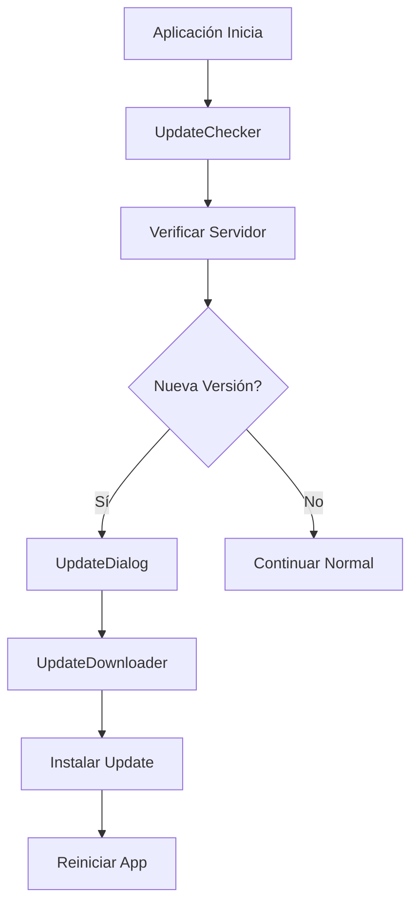

# 🔄 Sistema de Auto-Actualización - AlertasQB

## 📋 Descripción

Este sistema permite que la aplicación AlertasQB se actualice automáticamente desde un servidor remoto, eliminando la necesidad de copiar manualmente archivos entre computadores cada vez que realizas mejoras.

## 🚀 Características

- ✅ **Verificación automática** al iniciar la aplicación
- ✅ **Descarga automática** de nuevas versiones
- ✅ **Instalación sin intervención** del usuario
- ✅ **Respaldo automático** de datos importantes
- ✅ **Interfaz gráfica** para el proceso de actualización
- ✅ **Manejo de errores** y timeout de red
- ✅ **Preservación de configuraciones** del usuario

## 📁 Archivos del Sistema

```
src/utils/
├── updater.py          # Sistema principal de actualización
├── version.py          # Configuración de versión
└── github_updater.py   # Adaptador para GitHub (opcional)

create_release.py       # Script para crear releases
setup_github_updates.py # Configurar GitHub como servidor
```

## 🛠️ Configuración Inicial

### 1. Configurar Servidor de Actualizaciones

#### Opción A: Usar GitHub Releases (Recomendado)
```bash
python setup_github_updates.py
```

#### Opción B: Servidor Propio
Edita `src/utils/version.py`:
```python
UPDATE_SERVER_URL = "https://tu-servidor.com/alertasqb/updates"
```

### 2. Instalar Dependencias
```bash
pip install requests packaging
```

## 📝 Flujo de Trabajo

### Para el Programador (Tu Flujo):

1. **Realizar Mejoras** en el código
2. **Crear Release** automáticamente:
   ```bash
   python create_release.py --changelog "Descripción de mejoras"
   ```
3. **Subir a Servidor** (automático con GitHub)

### Para el Usuario Final:

1. **Abrir aplicación** normalmente
2. **Verificación automática** (en segundo plano)
3. **Dialog de actualización** aparece si hay nuevas versiones
4. **Click "Actualizar"** y la aplicación se actualiza sola
5. **Reinicio automático** con nueva versión

## 🎯 Casos de Uso

### Escenario Típico:
```
1. Tu computador (Programador):
   - Mejoras dashboard con nuevos gráficos
   - Ejecutas: python create_release.py --changelog "Nuevos gráficos mejorados"
   - Se genera AlertasQB-v1.2.1.zip y se sube a GitHub

2. Computador remoto (Usuario):
   - Usuario abre AlertasQB
   - Aparece: "Nueva versión 1.2.1 disponible - Nuevos gráficos mejorados"
   - Usuario click "Actualizar"
   - Descarga automática + instalación + reinicio
   - ¡Usuario tiene la nueva versión sin tu intervención!
```

## ⚙️ Configuraciones Avanzadas

### `src/utils/version.py`:
```python
# Configuraciones del sistema de actualización
UPDATE_CHECK_ON_STARTUP = True    # Verificar al iniciar
AUTO_DOWNLOAD = True              # Descargar automáticamente
FORCE_UPDATE = False              # Forzar actualización
UPDATE_CHECK_INTERVAL_HOURS = 24  # Verificar cada 24 horas
```

## 🔧 Scripts Disponibles

### `create_release.py` - Crear Nueva Versión
```bash
# Incremento automático (patch: 1.2.0 → 1.2.1)
python create_release.py --changelog "Corrección de errores"

# Incremento minor (1.2.0 → 1.3.0)  
python create_release.py --increment minor --changelog "Nueva funcionalidad"

# Incremento major (1.2.0 → 2.0.0)
python create_release.py --increment major --changelog "Cambios importantes"

# Versión específica
python create_release.py --version 1.5.0 --changelog "Versión especial"

# Solo empaquetar (sin compilar)
python create_release.py --no-build --changelog "Empaquetado rápido"
```

### Ejemplos de Changelog:
```bash
python create_release.py --changelog "
✅ Corregido error en gráfico de torta
🆕 Añadidos nuevos colores por tipo de alerta  
🔧 Mejorado rendimiento del dashboard
📊 Nuevas estadísticas en KPIs
"
```

## 🏗️ Arquitectura del Sistema



## 🛡️ Seguridad y Respaldos

- **Backup automático** de `data/` y `config/`
- **Preservación** de configuraciones de usuario
- **Rollback** en caso de error en instalación
- **Verificación** de integridad de descargas
- **Timeout** para evitar bloqueos de red

## 🚨 Manejo de Errores

- **Sin conexión**: Se omite silenciosamente
- **Servidor no disponible**: Error silencioso, no interrumpe uso
- **Descarga fallida**: Se informa al usuario, opción de reintentar
- **Instalación fallida**: Se restaura versión anterior

## 📊 Ventajas del Sistema

| Antes (Manual) | Después (Automático) |
|---|---|
| ❌ Compilar en tu PC | ✅ Script automático |
| ❌ Crear ZIP manualmente | ✅ Empaquetado automático |
| ❌ Copiar a otro PC | ✅ Descarga automática |
| ❌ Usuario debe instalar | ✅ Instalación transparente |
| ❌ Riesgo de perder datos | ✅ Backup automático |
| ❌ Proceso de 30+ minutos | ✅ Proceso de 2 minutos |

## 🎯 Resultado Final

**Tu flujo de trabajo se reduce de:**
```
1. Hacer cambio en código (5 min)
2. Compilar aplicación (5 min)  
3. Crear ZIP (2 min)
4. Conectar a PC remoto (5 min)
5. Copiar archivos (10 min)
6. Configurar/probar (10 min)
Total: ~37 minutos
```

**A simplemente:**
```
1. Hacer cambio en código (5 min)
2. python create_release.py --changelog "Mejora X" (2 min)
Total: ~7 minutos (¡automático para el usuario!)
```

## 🏃‍♂️ Inicio Rápido

1. **Configura GitHub** (una sola vez):
   ```bash
   python setup_github_updates.py
   ```

2. **Crea tu primer release**:
   ```bash
   python create_release.py --changelog "Sistema de actualización implementado"
   ```

3. **¡Listo!** La próxima vez que hagas cambios, solo ejecuta el step 2 y los usuarios recibirán la actualización automáticamente.

---

**¡Ahora puedes concentrarte 100% en programar y mejorar la aplicación, sin perder tiempo en distribución manual!** 🚀
